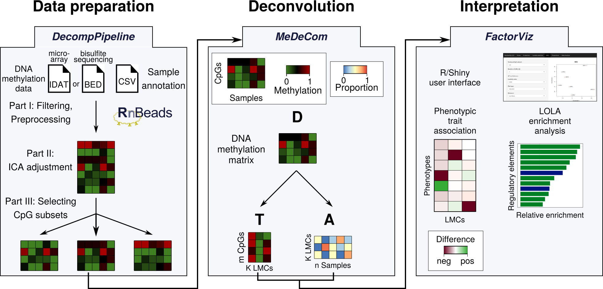

# DecompPipeline
*DecompPipeline* provides a comprehensive list of preprocessing functions for performing reference-free deconvolution of complex DNA methylation data. It is an integral part of a recently published protocol [doi:10.1101/853150](https://doi.org/10.1101/853150) for reference-free deconvolution and is independent of the deconvolution tool used. 



# Installing DecompPipeline
*DecompPipeline* can be directly installed from GitHub within an R session on Linux systems. For macOS, we provide a binary version of [MeDeCom](https://github.com/lutsik/MeDeCom/releases/download/v1.0.0/MeDeCom_1.0.0.tgz), which needs to be installed prior to installing *DecompPipeline*. However, for **Windows** operating systems, a *MeDeCom* and thus *DecompPipeline* cannot be directly installed through R, but we provide a [Docker image](https://hub.docker.com/r/mscherer/medecom) with all packages installed.

```
install.packages("devtools")
devtools::install_github("CompEpigen/DecompPipeline")
```
Installation has been tested on the following operating systems:

Type |   OS |   Version |   R-version |   Installation successful |   Protocol tested |   Comments
---- |	 ---- | ---- | ---- | ---- | ---- | ---- 
Linux 						|  Debian 	|  7  		|  R-3.5.2 |  Yes |  Yes |   
Linux						| 	 Debian |  7	  	|  R-3.6.0 |  Yes |  Yes |  
Linux						| 	Debian					  	|  8	|  R-3.5.3	  |  Yes |  Yes (reduced)  |   
Linux						| 	Debian						| 8									|  R-3.6.1 |  Yes | 	No	|  
Linux						| 	Debian						| 	8									|  R-4.0	  | 		Yes	| 	No	|  
Linux						| 	Debian						| 	10					|  R-3.5.2 |  Yes |  Yes (reduced) |  	
Linux						| 	Fedora	|  	28									|  R-3.5.3 | 	Yes |  Yes (reduced) |  
Linux						| 		Fedora					| 	31									|  R-3.6.1 | 	Yes  |  Yes (reduced) |  `igraph' dependency fails to install
Linux						| 	CentOS	| 	8.0				|  R-3.5.2 |  Yes	|  Yes (reduced) |  	
Linux						| 	CentOS						| 	8.0									|  R-3.6.1 |  Yes |  Yes (reduced) | 	
Linux						| 	Ubuntu					| 	19									|  R-3.6.1 | 		Yes	|  Yes (reduced) |  
MacOS		| 							| 	10.14								|  R-3.5.1 | 		Yes	|  Yes (reduced)	| 	binary release used	
MacOS					| 							| 10.15							|  R-3.6.0 | 		Yes	|  Yes (reduced)	| 	
Windows						| 	10						| 	Pro									|  R-3.6.1 |  Yes |  Yes (reduced)	| 	Use the `windows' branch of [MeDeCom](https://github.com/lutsik/MeDeCom) 
Docker					| 	Debian						| 	10									|  R-3.6.2 | 		Yes	| 	Yes (reduced) |  [Docker image](https://hub.docker.com/r/mscherer/medecom) available	
Docker					| 	Windows						| 	10									|  R-3.6.2 | 		Yes	| 	Yes (reduced) |  [Docker image](https://hub.docker.com/r/mscherer/medecom) available																

In the reduced protocol, we executed preprocessing and a single *MeDeCom* run on a reduced dataset.

# Using Decomp
*DecompPipeline* includes three major steps, all of them are extensively documented. A more detailed introduction into *DecompPipeline* can be found in the package [vignette](vignettes/DecompPipeline.md) and in the [protocol](vignettes/DeconvolutionProtocol.md) .

## 1. CpG filtering
There are dedicated preprocessing steps for both array-based data sets (```prepare_data```) and sequencing-based data sets (```prepare_data_BS```).

## 2. Selecting CpG subsets
To select a subset of CpGs for downstream deconvolution analysis, the function ```prepare_CG_subsets``` can be used.

## 3. Starting MeDeCom
After these preprocessing steps, a deconvolution run can be started using *DecompPipeline* by envoking ```start_decomp_pipeline```.

## Combining the above steps
We also provide a wrapper functions that executes all the above steps in a single command (```start_decomp_pipeline```).
